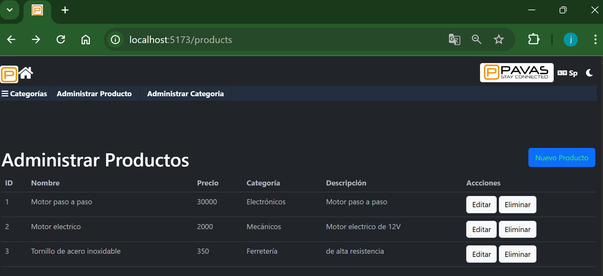
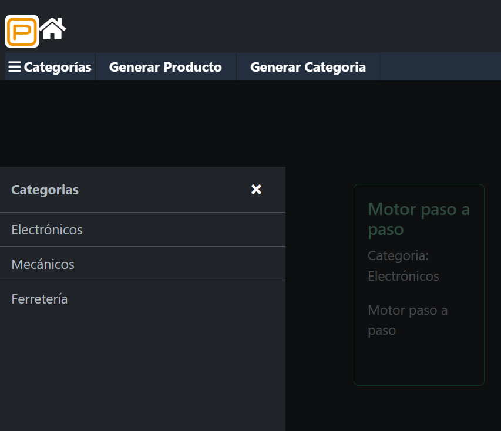
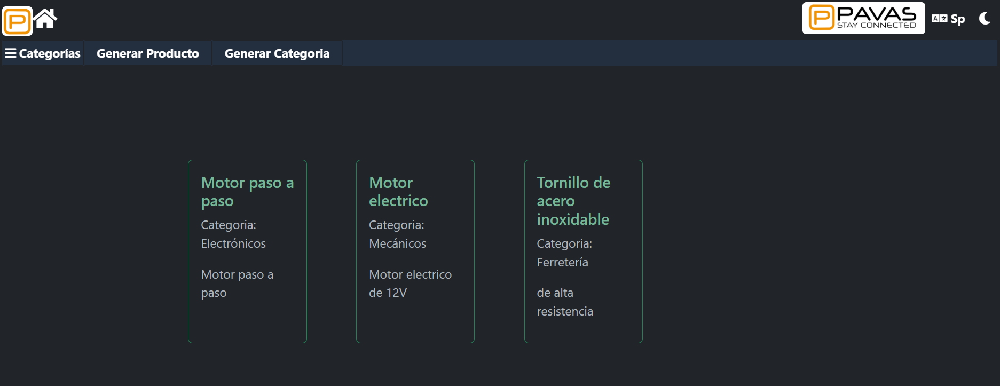
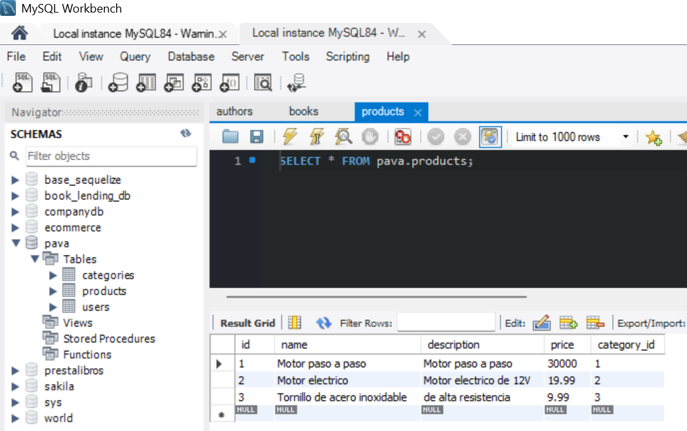
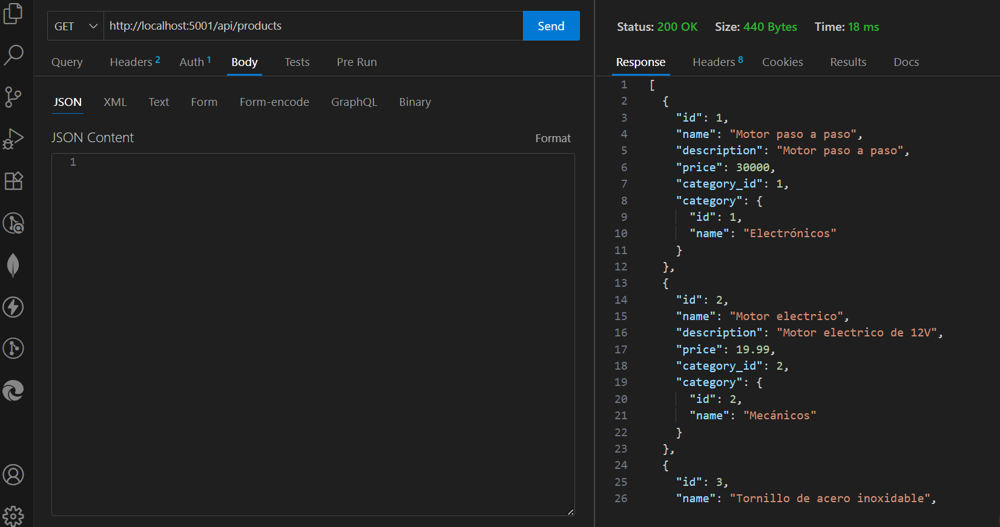
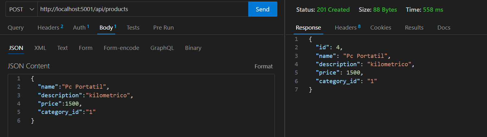
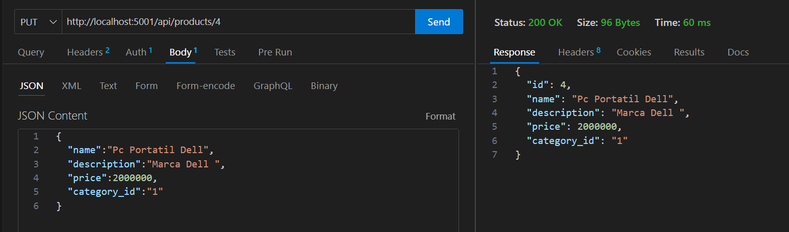
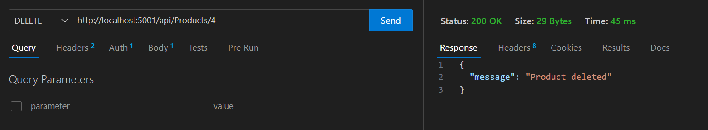

1. Instalar el proyecto desde github o descargar la carpeta.

2. Ejecutar el servicio de sql (por ejemplo Workbench) y editar el archivo .env.example con
los nuevos valores, luego cambar el nombre a .env

++ Ejecutar el sql del archivo pava.sql en la consola del servicio sql o gestor de base de datos.

3. Habiendo ingresado al proyecto ejecutar desde la terminal cd backend

4. Luego ejecutar npm install

5. Luego ejecutar npm run dev

6. Habiendo ingresado al proyecto ejecutar desde la terminal cd frontend

7. Luego ejecutar npm install

8. Luego ejecutar npm run dev

9. ejecutar http://localhost:5001/api/seed  para llenar la base de datos con productos y categorias.

LISTA DE CATEGORIAS:

LISTA DE PRODUCTOS:

Vista de Workbench:

En el backend los endpoints son:

con products o categories:

Get: http://localhost:5001/api/products

Vista de ThunderClient:

Get: http://localhost:5001/api/categories/1

Post: http://localhost:5001/api/products
con el body
{
  "name":"lapicero",
  "description":"kilometrico",
  "price":2000,
  "category_id":"1"
}

Vista de ThunderClient:

Put: http://localhost:5001/api/products/4
con el body
{
  "name":"lapicero negro",
  "description":"kilometrico",
  "price":1500,
  "category_id":"1"
}
Vista de ThunderClient:

Delete:http://localhost:5001/api/products/1

Vista de ThunderClient:

vista

